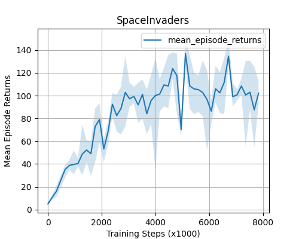
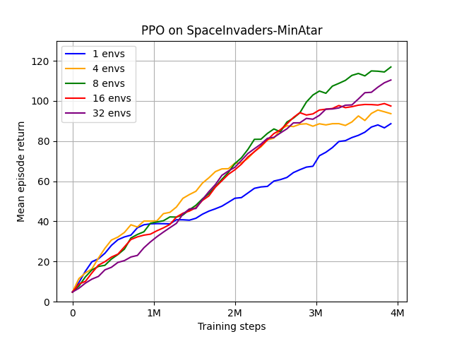
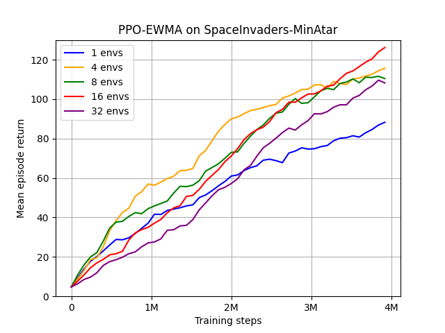

# PPX: PPO Algorithms in JAX

This repo features a high-speed JAX implementation of the [Proximal Policy Optimisation (PPO)](https://arxiv.org/abs/1707.06347) algorithm.
The algorithm is given as a single file implementation so that all the design choices are clear.


## Usage

The algorithm is run by running the python script from the home directory. A custom config file can be given as follows,
```python
python3 ppx/systems/ppo.py --config-name=ppo_CartPole.yaml
```
Since [hydra](https://hydra.cc/docs/intro/) is used for managing configurations, overide parameters can be passed as arguments to this command.
The default parameters can be changes in the relevant config file.

A simple function to plot the return during training is provided in the `notebooks/` directory.

## Results

| Cartpole | SpaceInvaders |
| :----: | :----: |
|  |  | 

## Installation

We recommend managing dependencies using a virtual environment, which can be installed with the following commands,
```
python3.9 -m venv venv
source venv/bin/activate
```

Install dependencies using the requirements.txt file:

```
pip install -r requirements.txt
```
The codebase is installed as a pip package with the following command:
```
pip install -e .
```

Note JAX must be separately installed for the specific device used. For straightforward CPU usage use,
```
pip install -U "jax[cpu]"
```

In order to use JAX on your accelerators, you can find more details in the [JAX documentation](https://github.com/google/jax#installation).

## Development

### Features in development

PPO-EWMA 
: a batch size-invariance algorithm that uses exponentially weighted moving averages to remove dependence on the batch-size hyperparameter.
- The next steps are tests with the learning rate adjustment, and advantage norm adjustment.
- The image below, shows the variance between batch sizes. The right image shows the current results using EWMA. The performance is slightly higher, but the variance greater.

| PPO | PPO-EWMA | 
| :---: |  :---: | 
|  |  |

### Possible improvements
- Add an env wrapper to use the [Jumanji](https://github.com/instadeepai/jumanji/) style step method which returns a `state` and `Timestep`.
- Add a KL diverange PPO algorithm
- Add tests with different learning rates. Include the effect of learning rate annealing.


## Acknowledgements

The code is based on the format of [Mava](https://github.com/instadeepai/Mava.git) and is inspired from [PureJaxRL](https://github.com/luchris429/purejaxrl) and [CleanRL](https://github.com/vwxyzjn/cleanrl).


